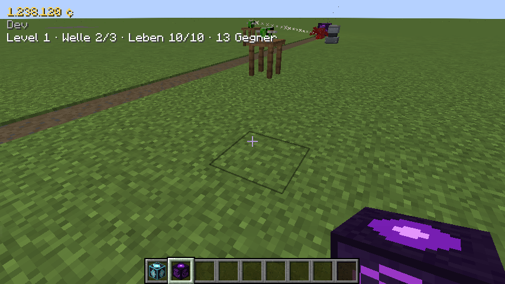
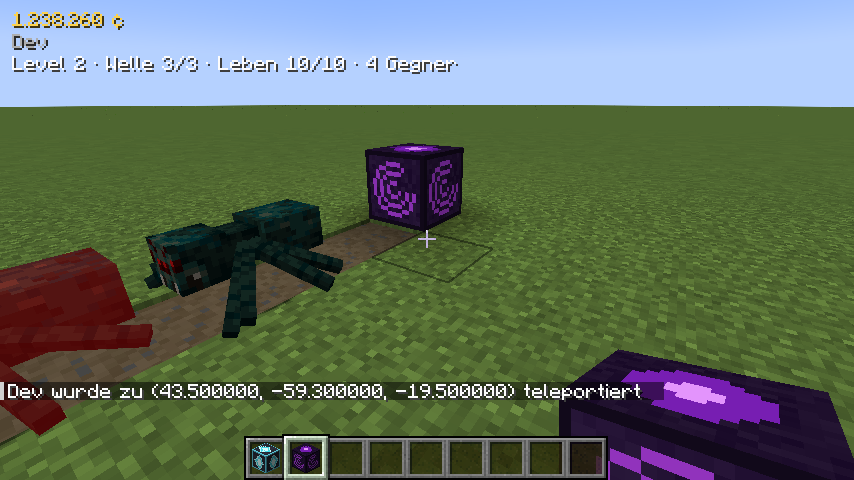
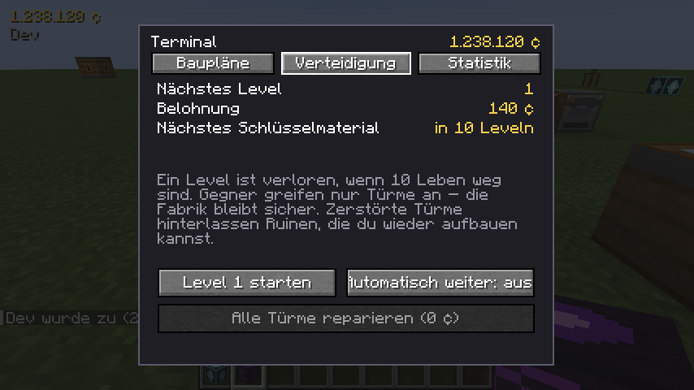

# Craftorio

Factorio-artige Automatisierung, eine Credits-Wirtschaft und Tower Defense für Minecraft.
Das vollständige Spielkonzept steht in [docs/KONZEPT.md](docs/KONZEPT.md).

- Minecraft **1.21.1**, **NeoForge**, Java **21**
- Build-System: Gradle mit [ModDevGradle](https://github.com/neoforged/ModDevGradle)

## Entwicklung

```bash
./gradlew runData      # Datengeneratoren: Modelle, Blockstates, Tags, Übersetzungen -> src/generated/resources
./gradlew runClient    # Minecraft-Client mit der Mod starten
./gradlew runClient -PquickPlay=<Welt>   # direkt in eine Einzelspielerwelt springen
./gradlew runServer    # Dedizierten Server starten
./gradlew build        # Mod-JAR bauen und Unit-Tests ausführen -> build/libs/
./gradlew runGameTestServer   # GameTests (Tests im laufenden Spiel) auf einem Server ohne Grafik
```

`runData` muss einmal nach dem Klonen und nach jeder Änderung an den Datengeneratoren
(`de.craftorio.datagen`) laufen. Die generierten Dateien werden nicht eingecheckt.

IntelliJ IDEA: Projekt als Gradle-Projekt öffnen; die Run-Konfigurationen werden beim Sync erzeugt.

## Aktueller Spielstand

### M1 – Wirtschaftskern

- Jeder Spieler gehört zu genau einem **Team**; beim ersten Betreten entsteht ein Solo-Team.
  Das Team teilt ein **Credits-Konto** (¢), das oben links im HUD angezeigt wird.
- **Handelsposten**: nimmt Items per Rechtsklick, Trichter oder (später) Förderband an und
  schreibt ihren Verkaufswert dem Team gut. Items ohne Preis werden abgelehnt.
- **Preise** kommen aus der Data Map `data/craftorio/data_maps/item/sell_prices.json`
  (per Datapack änderbar, `/reload`) und stehen im Item-Tooltip.
- Befehle:

| Befehl | Wirkung |
|---|---|
| `/craftorio credits` | Kontostand des eigenen Teams |
| `/craftorio credits add\|set <Spieler> <Betrag>` | Konto ändern (Operator) |
| `/craftorio team` / `team info` | Team, Kontostand, Mitglieder |
| `/craftorio team list` | Alle Teams |
| `/craftorio team create <Name>` | Neues Team gründen |
| `/craftorio team invite <Spieler>` | Spieler einladen |
| `/craftorio team join <Name>` | Einladung annehmen |
| `/craftorio team leave` | Team verlassen (neues, leeres Solo-Team) |

Verlässt das letzte Mitglied ein Team, wird es aufgelöst und sein Guthaben wandert mit.


### M2 – Oberfläche

- **Erzfelder** (Eisen, Kupfer, Kohle) entstehen als Flecken an der Oberfläche, weiter weg vom Ursprung größer.
  Je ein kleines Start-Feld liegt garantiert nahe dem Spawn. Feldblöcke sind **unerschöpflich**; von Hand abgebaut
  geben sie ein Item und bleiben stehen.
- **Brenner-Bohrer**: auf ein Feld setzen, mit Brennstoff (Kohle, Holz …) füttern. Er baut die 3×3 Blöcke darunter
  ab (0,03 Items/s pro Feldblock, voll belegt 0,27/s) und gibt die Ausbeute nach vorne ab. Abbauflächen zweier Bohrer
  dürfen sich **nicht überlappen** – ein voll bebautes Feld liefert also einen festen Maximaldurchsatz.
  Rechtsklick mit leerer Hand zeigt den Status und nimmt gepufferte Ausbeute heraus.
- **Förderband** mit zwei Spuren (1,875 Blöcke/s, 4 Items pro Spur und Block). Bänder laufen durch Kurven,
  laden seitlich auf die nahe Spur, nehmen fallengelassene Items auf, tragen Spieler mit und liefern am Ende in
  alles mit Inventar (Kisten, Handelsposten, Bohrer-Brennstoff …).
- **Greifarm**: bewegt 1 Item/s vom Block dahinter in den Block davor; legt auf Bänder auf die ferne Spur.
- Alle Blöcke funktionieren auch mit Vanilla-Trichtern und -Kisten.


### M3 – Verarbeitung & Energie

- **Kohle-Generator**: verbrennt Brennstoff zu Strom (60 FE/t, Puffer 20.000 FE) – nur solange Platz im Puffer ist.
- **Strommast**: verbindet sich automatisch mit Masten im Umkreis von 8 Blöcken (sichtbare Kupferkabel) und
  versorgt alle Maschinen und Generatoren im Umkreis von 2 Blöcken. Rechtsklick zeigt die Netzauslastung.
  Bei Strommangel wird die Energie anteilig verteilt – alle Maschinen werden gleich langsamer.
  Das Netz arbeitet mit Forge Energy (FE) und versorgt auch FE-Maschinen anderer Mods.
- **Elektro-Schmelzofen** (Vanilla-Schmelzrezepte, 80 Ticks, 20 FE/t), **Presse** (15 FE/t) und
  **Montagemaschine** (25 FE/t, Rezept per Pfeiltasten in der GUI wählen; jeder Eingangsslot nimmt genau
  seine Zutat an). Alle Maschinen haben eine GUI und arbeiten mit Bändern und Greifarmen zusammen.
- **Zwischenprodukte** mit Wertschöpfung (Preise ×10 skaliert):

| Kette | Preis |
|---|---|
| Rohes Eisen → Eisenbarren → Eisenplatte | 10 → 16 → 22 ¢ |
| Kupferbarren → 2 Kupferkabel | 16 → 2 × 12 ¢ |
| 2 Eisenplatten → Zahnrad | 44 → 60 ¢ |
| 3 Kabel + 1 Platte → Schaltkreis | 58 → 85 ¢ |
| 2 Zahnräder + 1 Platte + 2 Kabel → Motor | 166 → 240 ¢ |

- Maschinenrezepte sind Datapack-JSON (`craftorio:pressing`, `craftorio:assembling`).


### M4 – Terminal, Baupläne & Werkbänke

Craftorio-Maschinen entstehen in zwei Schritten: **Bauplan im Terminal freischalten** (Credits, ab Stufe 2 plus
Schlüsselmaterial) und **an der Werkbank aus Rohstoffen bauen**. Vanilla-Rezepte gibt es nur noch für
**Konstruktionswerkbank** und **Terminal**.

- **Terminal**: Bauplan-Baum mit Voraussetzungen, Preisen und Materiallisten (Tooltip); Tab **Statistik** mit
  Einnahmen, Ausgaben, Einnahmen der letzten 10 Minuten und den meistverkauften Waren.
- **Werkbänke**: Konstruktionswerkbank (Stufe 1) → Montagewerkbank (2) → Präzisionswerkbank (3). Aufgerüstet wird
  am Platz per Rechtsklick mit dem **Aufrüstsatz**. Jede Werkbank baut alle Baupläne ihrer Stufe und darunter aus dem
  Spielerinventar (Klick = 1, Shift-Klick = 10); fehlendes Material ist rot markiert.
- **Baupläne sind Team-Wissen**: Beim Beitritt zu einem Team wandern sie mit, beim Austritt behält man eine Kopie.
- **Start-Baupläne** (gratis): Handelsposten, Brenner-Bohrer, Förderband, Greifarm.
- **Schlüsselmaterialien** (Bohrkern, Resonanzkristall, Tiefenkern, Sternenerz-Splitter) kommen ab M5 aus der
  Tower Defense; bis dahin per `/give`.
- Baupläne sind Datapack-JSON: `data/<namespace>/craftorio/blueprint/*.json`
  (`result`, `ingredients`, `tier`, `cost`, `unlock_items`, `requires`, `order`).


### M5 – Tower Defense I

- **Verteidigungszone**: Zonenkern aufstellen (ein Kern pro Team, nur Oberwelt). Im Umkreis von 32 Blöcken
  kommen ein **Feindportal** und eine **durchgehende Linie aus Pfadblöcken** (≥ 20 Blöcke, ohne Abzweigungen,
  Stufen von ±1 Block erlaubt) vom Portal bis zum Kern. Rechtsklick auf den Kern prüft den Pfad.
- **Level** startet im Terminal (Tab *Verteidigung*), optional automatisch weiter nach einem Sieg. Jedes Level
  hat 3–8 Wellen; Gegnerzahl und -leben steigen pro Level und pro weiterem Teammitglied online.
  **10 Leben** – jeder durchgekommene Gegner kostet Leben (Brecher 2, Brutmutter 10).
- **Gegner**: Krabbler (schnell, schwach), Brecher (ab Level 5, bleibt stehen und zertrümmert Türme),
  Spucker (ab Level 10, greift aus 7 Blöcken an), **Brutmutter** als Boss jedes 10. Levels.
  Gegner greifen **nur Türme** an – nie die Fabrik, Blöcke oder Spieler; Spieler können sie nicht verletzen.
- **Türme** (Baupläne im Terminal): **Armbrustturm** (Bolzen), **Geschützturm** (Patronen), **Tesla-Turm**
  (Strom aus dem Netz, trifft bis zu 3 Gegner). Munition per Hand, Trichter, Band oder Greifarm.
  GUI mit Lebenspunkten und **Aufrüstung Stufe I–V** (Credits + Eisenplatten/Kupferkabel/Zahnräder/Motoren).
- Bei 0 HP wird ein Turm zur **Ruine** (behält seine Stufe); Rechtsklick baut sie für Credits wieder auf.
  *Alle Türme reparieren* im Terminal repariert Schäden und Ruinen auf einen Schlag.
- **Belohnung**: Credits pro Level; alle 10 Level ein **Schlüsselmaterial** am Zonenkern (Level 10: Bohrkern →
  Montagewerkbank, Level 20: Resonanzkristall, Level 30: Tiefenkern → Präzisionswerkbank, danach Sternenerz-Splitter).
- Das HUD zeigt während eines Levels Welle, Leben und verbleibende Gegner.





### M6 – Höhlenschicht

- **Schichten** (nur in neu erzeugten Chunks): Oberfläche ab Y 50, darunter **Deckgestein** (Y 40–49),
  die **Höhlenschicht** (Y 0–39) und eine zweite Deckgesteinsschicht (Y −10 bis −1). Die Höhlenschicht besteht
  zunächst komplett aus unzerstörbarem **Höhlengeröll** – man kann nicht hineingraben.
- **Höhleneingang** (Bauplan Stufe 2, braucht die Montagemaschine): an der Oberfläche aufstellen, dann Material
  anliefern (128 Bruchstein, 32 Eisenplatten, 16 Zahnräder, 8 Motoren – per Hand, Band oder Greifarm) und mit
  Strom (40 FE/t über einen Strommast) eine Minute bohren lassen.
- Danach öffnet sich ein **Schacht mit Gerüst** (Schleichen zum Absteigen; oberhalb der Höhlen mit Stein
  verkleidet) und der Höhlenbereich von **7×7 Chunks** um den Eingang wird ausgehöhlt: eine große Halle mit
  Säulen, Tuffboden und Platz zum Bauen. Außerhalb bleibt eine Wand aus Höhlengeröll – weitere Eingänge
  erweitern das Gebiet nahtlos.
- **Höhlen-Rohstoffe** als unerschöpfliche Felder auf dem Hallenboden: **Zinn, Blei, Schwefel, Gold, Quarz**.
  Neue Produkte: Zinn-/Bleibarren (Schmelzofen), **Batterie** und **Fortgeschrittener Schaltkreis** (Montage).

- **Warenaufzug** (Bauplan nach dem Höhleneingang, 2 Stück pro Bau): Zwei Aufzüge in derselben Spalte
  (gleiches X/Z) verbinden sich automatisch – auch durch Deckgestein und massiven Fels, bis 256 Blöcke weit.
  Rechtsklick wechselt den Modus: *nach oben senden*, *nach unten senden* oder *empfangen*. Sender nehmen
  Items per Band/Greifarm/Trichter an (bis 40 Items/s), Empfänger geben sie nach vorne aus.


### M7 – Minenschicht

- **Minenschicht** (Y −59 bis −11, nur in neu erzeugten Chunks): unter dem zweiten Deckgestein, zunächst
  komplett aus unzerstörbarem **Minengeröll**. Niedrigere Gänge mit vielen Säulen, Basaltboden und Tiefenschiefer.
- **Minenschacht** (Bauplan Stufe 3 – Präzisionswerkbank, braucht den Warenaufzug): wird in einem
  freigeschalteten Bereich der **Höhlenschicht** gebaut (sonst Fehlermeldung), braucht 64 Bleibarren,
  16 Motoren, 8 Batterien und 8 fortgeschrittene Schaltkreise und bohrt mit **80 FE/t** (ein Kohlegenerator
  reicht nicht). Danach führt ein Gerüstschacht durch das Deckgestein in die Minen und 7×7 Chunks werden ausgehöhlt.
- **Minen-Rohstoffe**: **Diamant, Titan, Uran, Kristall**. Titan → Titanbarren (Ofen) → Titanplatte (Presse);
  Uran → Uranpellet (Presse) → **Brennstab** (Montage, mit Titanplatten); Kristallsplitter → **Energiekristall**.
- **Maschinen-Stufen**
  - **Elektrischer Bohrer** (Stufe 2, Freischaltung mit dem Resonanzkristall aus TD-Level 20): 3×3, doppelt so
    schnell wie der Brenner-Bohrer, 30 FE/t statt Brennstoff. **Tiefenbohrer** (Stufe 3): **5×5**, 4× schneller
    pro Block (bis 3 Items/s), 80 FE/t. Abbauflächen verschiedener Bohrer dürfen sich weiterhin nicht überlappen.
  - **Schnelles Förderband** (3,75 Blöcke/s, Stufe 2) und **Express-Förderband** (5,625 Blöcke/s, Stufe 3);
    alle Bänder lassen sich beliebig verbinden.
  - **Reaktor** (Stufe 3): 400 FE/t aus Brennstäben (5 Minuten pro Stab), 200.000 FE Puffer.
- **Tower Defense**: Ab Level 20 kommen **Kristallgolems** – ihr Panzer lässt nur 35 % von Munitionsschaden
  durch; Energietürme (Tesla, Laser) machen vollen Schaden. Der **Laserturm** (Stufe 3) schießt 14 Blöcke weit
  mit 30 Schaden (800 FE pro Schuss).
- Admin-Befehl: `/craftorio layer unlock caves|mines` schaltet den Bereich um die eigene Position ohne Eingang
  frei (für Tests oder alte Welten).


### M8 – Coop & Polish (Teil 1)

- **Team-Rechte**: Das erste Mitglied ist die **Teamleitung**. Sie kann Mitglieder entfernen
  (`/craftorio team kick <Spieler>`), die Leitung übergeben (`/craftorio team leader <Spieler>`) und festlegen,
  wer Credits ausgeben darf (`/craftorio team spending all|leader`) – gilt für Baupläne, Turm-Upgrades,
  Reparaturen und Wiederaufbau. `/craftorio team info` zeigt Leitung und Ausgaberecht.
- **Blockschutz zwischen Teams** (Server-Config `protection.enabled`, Standard an): Maschinen, Türme und alle
  Blöcke mit Inventar/Block-Entity gehören dem Team, das sie platziert hat. Andere Teams können sie weder abbauen
  noch öffnen, Explosionen zerstören sie nicht, und Greifarme nehmen/legen nichts über Teamgrenzen hinweg.
  Tritt ein Solo-Spieler einem Team bei, gehen seine Blöcke an das neue Team über. Operatoren im Kreativmodus
  dürfen alles.
- **Leitfaden** (neuer Terminal-Tab): 19 Ziele vom ersten Verkauf bis zur Minenschicht (Verkäufe, Baupläne,
  TD-Level, Gesamtverdienst) mit Credit-Belohnungen zum Abholen – einmal pro Team.
- **Skalierung**: Pro zusätzlichem Teammitglied online kommen je Welle 2 Krabbler mehr (zusätzlich zu +35 %
  Gegner-HP); die Belohnung bleibt gleich.
- **Balancing-Test**: Ein GameTest prüft, dass jede Presse-/Montagestufe mindestens 10 % Wert schafft und kein
  Schmelzrezept Wert vernichtet.
- *Noch offen: EMI- und Jade-Plugins (warten auf Netzwerkfreigabe der Maven-Hosts).*


## Projektstruktur

```
src/main/java/de/craftorio/
├── Craftorio.java          Mod-Einstiegspunkt
├── CraftorioConfig.java    Server-Konfiguration
├── registry/               Blöcke, Items, Block-Entities, Creative-Tab
├── team/                   Teams, Konto, Rechte (TeamRegistry ist reine Logik mit Unit-Tests)
├── protection/             Blockschutz zwischen Teams
├── quest/                  Leitfaden (Ziele als reine Logik mit Unit-Tests)
├── economy/                Preise (Data Map), Verkauf, Handelsposten
├── world/                  Erzfelder, Weltgenerierung, Start-Felder
│   └── cave/               Höhlen-/Minenschicht, Form (reine Logik mit Unit-Tests), Eingänge/Schächte, Aushöhlen
├── machine/                Bohrer-Stufen (Abbaufläche, Produktionsrate), Verarbeitungsmaschinen
├── logistics/              Förderband-Stufen (BeltLane = reine Spur-Logik mit Unit-Tests), Greifarm, Warenaufzug
├── energy/                 Kohlegenerator/Reaktor, Strommast, Stromnetz (Verteilung als reine Logik mit Unit-Tests)
├── recipe/                 Maschinenrezepte (Presse, Montage)
├── blueprint/              Baupläne, Freischalt-Regeln, Terminal, Werkbänke
├── defense/                Tower Defense: Zone, Level-Ablauf, Gegner, Türme (LevelPlan/PathTracer/TowerStats = reine Logik)
├── menu/                   Container-Menüs der Maschinen
├── command/                /craftorio-Befehle
├── network/                Server→Client-Sync
├── client/                 HUD, Tooltips
├── gametest/               Tests im laufenden Spiel
└── datagen/                Datengeneratoren
src/test/java/              Unit-Tests (JUnit)
src/main/templates/         neoforge.mods.toml (wird aus gradle.properties befüllt)
src/main/resources/         Handgemachte Assets (Texturen)
```
