# Craftorio

Factorio-artige Automatisierung, eine Credits-Wirtschaft und Tower Defense für Minecraft.
Das vollständige Spielkonzept steht in [docs/KONZEPT.md](docs/KONZEPT.md).

- Minecraft **1.21.1**, **NeoForge**, Java **21**
- Build-System: Gradle mit [ModDevGradle](https://github.com/neoforged/ModDevGradle)

## Entwicklung

```bash
./gradlew runData      # Datengeneratoren: Modelle, Blockstates, Tags, Übersetzungen -> src/generated/resources
./gradlew runClient    # Minecraft-Client mit der Mod starten
./gradlew runClient -PquickPlay=<Welt>   # direkt in eine Einzelspielerwelt springen
./gradlew runClient -Pcompat           # zusätzlich mit EMI und Jade
./gradlew runServer    # Dedizierten Server starten
./gradlew build        # Mod-JAR bauen und Unit-Tests ausführen -> build/libs/
./gradlew runGameTestServer   # GameTests (Tests im laufenden Spiel) auf einem Server ohne Grafik
```

`runData` muss einmal nach dem Klonen und nach jeder Änderung an den Datengeneratoren
(`de.craftorio.datagen`) laufen. Die generierten Dateien werden nicht eingecheckt.

IntelliJ IDEA: Projekt als Gradle-Projekt öffnen; die Run-Konfigurationen werden beim Sync erzeugt.

## Aktueller Spielstand

### M1 – Wirtschaftskern

- Jeder Spieler gehört zu genau einem **Team**; beim ersten Betreten entsteht ein Solo-Team.
  Das Team teilt ein **Credits-Konto** (¢), das oben links im HUD angezeigt wird.
- **Handelsposten**: Rechtsklick öffnet die **Theke** (9 Slots): Items hineinlegen, der Wert wird angezeigt, erst
  der Button **Verkaufen** verkauft sie – so geht nichts aus Versehen weg. Trichter und Förderbänder verkaufen
  direkt. Der Erlös geht aufs Team-Konto; Items ohne Preis werden abgelehnt.
- **Preise** kommen aus der Data Map `data/craftorio/data_maps/item/sell_prices.json`
  (per Datapack änderbar, `/reload`) und stehen im Item-Tooltip.
- Befehle:

| Befehl | Wirkung |
|---|---|
| `/craftorio credits` | Kontostand des eigenen Teams |
| `/craftorio credits add\|set <Spieler> <Betrag>` | Konto ändern (Operator) |
| `/craftorio team` / `team info` | Team, Kontostand, Mitglieder |
| `/craftorio team list` | Alle Teams |
| `/craftorio team create <Name>` | Neues Team gründen |
| `/craftorio team invite <Spieler>` | Spieler einladen |
| `/craftorio team join <Name>` | Einladung annehmen |
| `/craftorio team leave` | Team verlassen (neues, leeres Solo-Team) |

Verlässt das letzte Mitglied ein Team, wird es aufgelöst und sein Guthaben wandert mit.

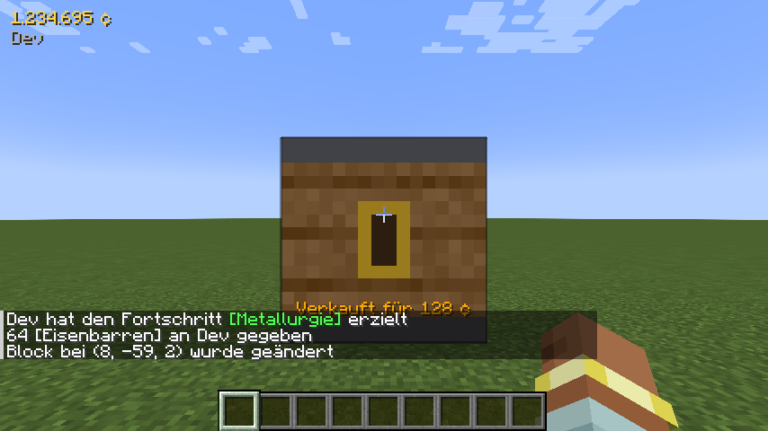

### M2 – Oberfläche

- **Erzfelder** (Eisen, Kupfer, Kohle) entstehen als Flecken an der Oberfläche, weiter weg vom Ursprung größer.
  Je ein kleines Start-Feld liegt garantiert nahe dem Spawn. Feldblöcke sind **unerschöpflich**; von Hand abgebaut
  geben sie ein Item und bleiben stehen.
- **Brenner-Bohrer**: auf ein Feld setzen, mit Brennstoff (Kohle, Holz …) füttern. Er baut die 3×3 Blöcke darunter
  ab (0,03 Items/s pro Feldblock, voll belegt 0,27/s) und gibt die Ausbeute nach vorne ab. Abbauflächen zweier Bohrer
  dürfen sich **nicht überlappen** – ein voll bebautes Feld liefert also einen festen Maximaldurchsatz.
  Rechtsklick öffnet ihn wie einen Ofen: Brennstoff-Slot (eine Kohle brennt, dann die nächste), Flamme,
  Feldblöcke und Rate sowie ein Ausgabe-Slot (ein Stapel), aus dem man die Ausbeute nimmt. Automatisch (Greifarm)
  kann nur Brennstoff hinein und Ausbeute heraus.

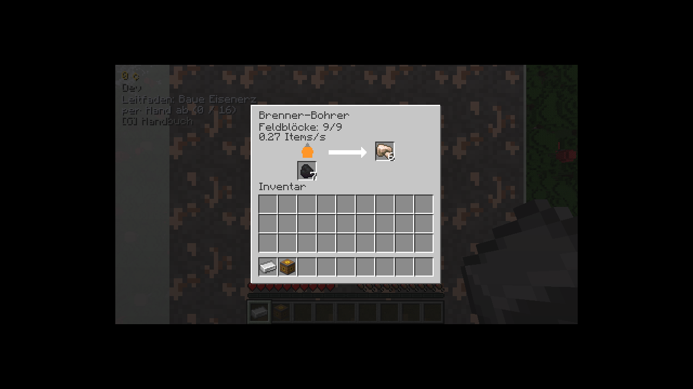
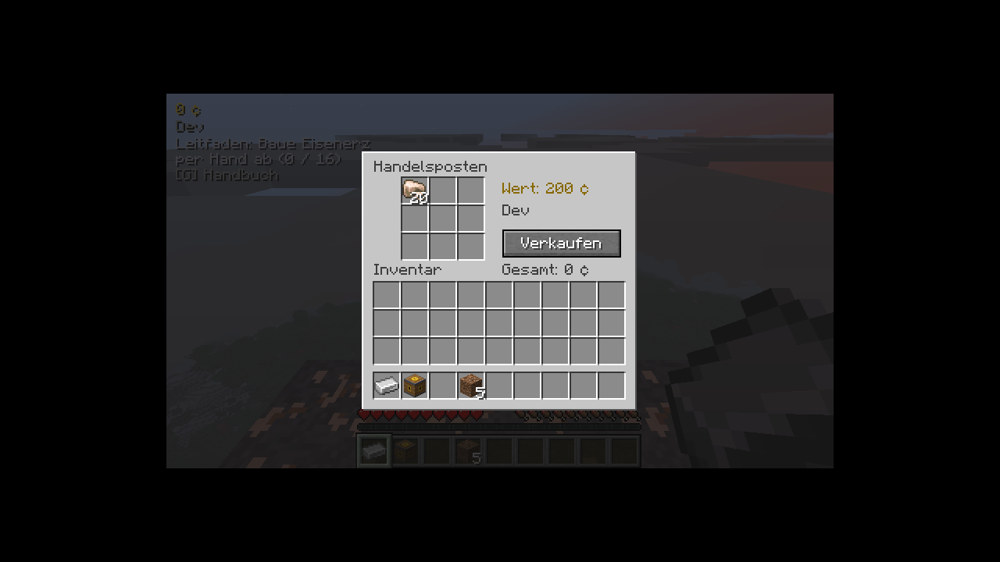
- **Förderband** mit zwei Spuren (1,875 Blöcke/s, 4 Items pro Spur und Block). Bänder laufen durch Kurven,
  laden seitlich auf die nahe Spur, nehmen fallengelassene Items auf, tragen Spieler mit und liefern am Ende in
  alles mit Inventar (Kisten, Handelsposten, Bohrer-Brennstoff …).
- **Greifarm**: bewegt 1 Item/s vom Block dahinter in den Block davor; legt auf Bänder auf die ferne Spur.
- Alle Blöcke funktionieren auch mit Vanilla-Trichtern und -Kisten.

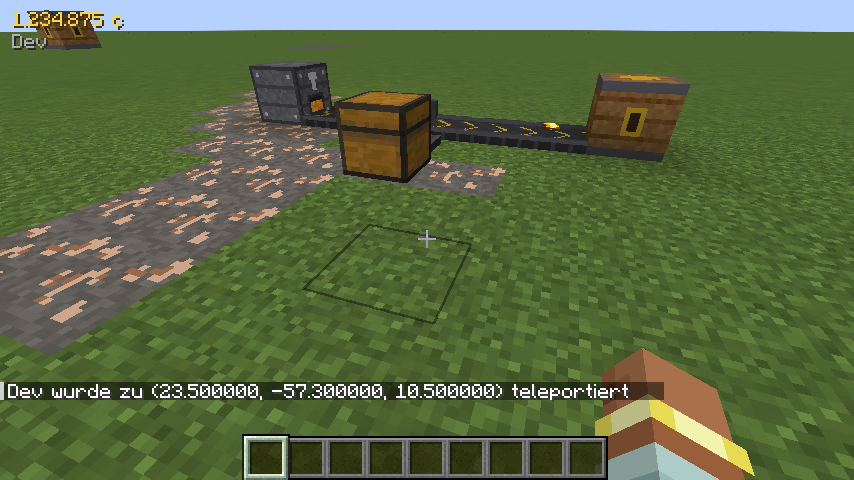

### M3 – Verarbeitung & Energie

- **Kessel + Dampfmaschine + Offshore-Pumpe** (ersetzen den Kohle-Generator): Der Kessel (Brennstoffslot, 1,8 MW) braucht
  eine Offshore-Pumpe direkt neben sich, die selbst am Ufer (Wasserquelle daneben oder darunter) steht. Bis zu zwei
  **Dampfmaschinen** direkt am Kessel liefern je 900 kW. Der Kessel verbrennt Brennstoff nur bei Bedarf; 1 Kohle (4 MJ)
  versorgt zwei Maschinen 2,2 s. Das Wasser kommt bis zum Flüssigkeitsnetz (U6) direkt aus der Pumpe.
- **Strommast**: verbindet sich automatisch mit Masten im Umkreis von 8 Blöcken (sichtbare Kupferkabel) und
  versorgt alle Maschinen und Generatoren im Umkreis von 2 Blöcken. Rechtsklick zeigt die Netzauslastung.
  Bei Strommangel wird die Energie anteilig verteilt – alle Maschinen werden gleich langsamer.
  Das Netz arbeitet mit Forge Energy (FE) und versorgt auch FE-Maschinen anderer Mods.
- **Steinofen** (Brennstoff, 90 kW, Geschwindigkeit 1: eine Platte in 3,2 s), **Elektro-Schmelzofen** (180 kW,
  Geschwindigkeit 2) und **Montagemaschine 1** (75 kW, Geschwindigkeit 0,5, Rezept per Pfeiltasten in der GUI wählen;
  jeder Eingangsslot nimmt genau seine Zutat an). Öfen schmelzen die Vanilla-Rezepte und Rezepte mit Mengen
  (2 Stein → 1 Steinziegel, `craftorio:smelting`). Alle Maschinen haben eine GUI und arbeiten mit Bändern und Greifarmen zusammen.
- **Zwischenprodukte** nach Factorio: Eisenplatte = Eisenbarren, Kupferplatte = Kupferbarren. Zahnrad (2 Eisen),
  Kupferkabel (1 Kupfer → 2), Schaltkreis (1 Eisen + 3 Kabel) und Rohr (1 Eisen) entstehen von Hand an der Werkbank
  (sofort) oder in der Montagemaschine (0,5 s bei Geschwindigkeit 1).
- Maschinenrezepte sind Datapack-JSON (`craftorio:smelting`, `craftorio:assembling`; Zeit in Ticks bei
  Geschwindigkeit 1 = Factorio-Sekunden × 20).

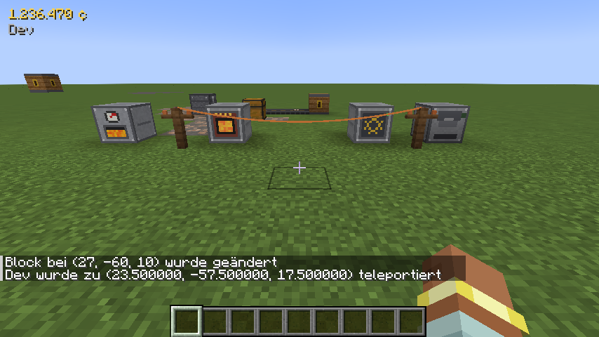
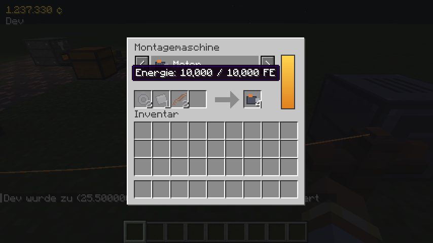

### M4 – Terminal, Werkbank & Baupläne

Craftorio-Maschinen entstehen **an der Werkbank aus Rohstoffen** (Handarbeit, sofort). Welche Rezepte ein Team
kennt, bestimmt die **Forschung** (siehe unten). Vanilla-Rezepte gibt es nur noch für die **Konstruktionswerkbank**
und das Handbuch-Ersatzbuch.

- **Terminal** (an der Werkbank gebaut): Tab **Forschung**, Tab **Statistik** mit Einnahmen, Ausgaben, Einnahmen der
  letzten 10 Minuten, den meistverkauften Waren und den Abschlusszeiten der Forschungen, Abwehr und Leitfaden.
- **Werkbank**: eine einzige, ohne Stufen. Sie baut alle Baupläne, die das Team kennt, aus dem Spielerinventar
  (Klick = 1, Shift-Klick = 10); fehlendes Material ist rot markiert.
- **Wissen ist Team-Wissen**: Beim Beitritt zu einem Team wandert es mit, beim Austritt behält man eine Kopie.
- **Start-Baupläne** (ohne Forschung): Zahnrad, Kupferkabel, Schaltkreis, Rohr, Steinofen, Brenner-Bohrer, Förderband,
  Greifarm, Kessel, Dampfmaschine, Offshore-Pumpe, Strommast, Elektro-Bohrer, Labor, rotes Wissenschaftspaket,
  Handelsposten, Terminal, Arena-Tor, Armbrustturm, Bolzen.
- **Arena-Siegel** (bronzen ab TD-Level 5, silbern ab 10, golden ab 20, Platin ab 30) kommen aus der Tower Defense; das
  jeweilige Siegel wird beim ersten Einreihen der ersten Forschung einer neuen Paketstufe abgegeben (Logistik-, Militär-,
  Chemie-Wissenschaftspaket, Minenschacht).
- Baupläne sind Datapack-JSON: `data/<namespace>/craftorio/blueprint/*.json` (`result`, `ingredients`, `order`).

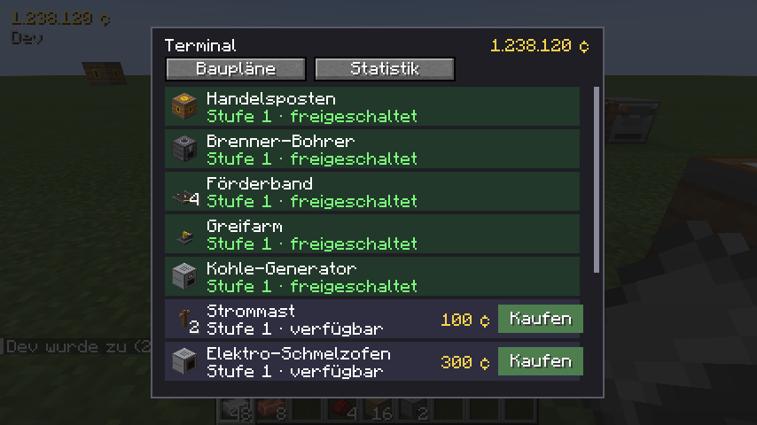
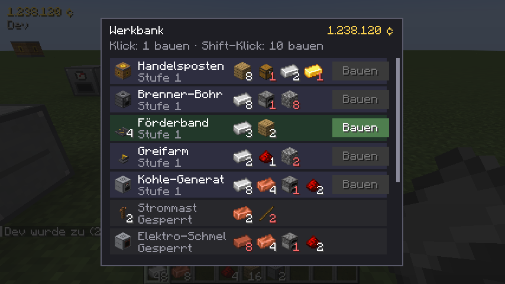

### M5 – Tower Defense (Arena)

- **Arena**: Das **Arena-Tor** (Gratis-Bauplan) in der Oberwelt aufstellen und rechtsklicken – es führt in die
  eigene Arena (eigene Dimension, ein Stadion pro Team). Auf der Tribüne: **Ausgang**, **Turmdepot** und das **Arena-Pult**
  (öffnet das Terminal im Tab *Abwehr*: Level starten, Welle rufen, Auto-Modus – ohne die Arena zu verlassen).
- **Jedes Level eine neue Karte** (41×41) mit Thema und Regel: **Wald** (Tarnung im Dickicht), **Berge**
  (Plateaus +30 % Reichweite, Geröll bremst), **Feuer** (Lavaschlote verbrennen Gegner), **Wasser** (Fluss mit
  Furten aus Trittsteinen, Flachwasser bremst) und jedes 10. Level das **Kolosseum** (Boss). Eines von drei Toren in der Westmauer ist
  offen, der Kern sitzt in der Ostmauer.
- **Weg legen**: mit dem **Pfadstab** vom offenen Tor zum Kern (Klick = Wegstück, nächster Klick in derselben
  Reihe/Spalte = gerade Linie, Schleichen + Klick entfernt). Der Pfadstab lehnt Abzweigungen, Kreuzungen und 2×2-Flächen sofort ab; Schleichen +
  Klick in die Luft zeigt den kürzesten Weg als Partikel. Rechtsklick auf den Kern prüft den Weg.
- **Türme** frei auf freiem Boden oder Plateaus: **Armbrustturm** (Bolzen), **Geschützturm** (Magazine: zehn Schüsse je Magazin, panzerbrechende +60 %),
  **Flammenwerfer-Turm** (Rohöl aus dem Arena-Vorrat, kurze Reichweite, bis 3 Ziele, Feuer ignoriert die Kristallpanzerung),
  **Tesla-Turm** und **Laserturm** (Strom). GUI mit Lebenspunkten, **Aufrüstung Stufe I–V** und **Zielmodus**
  (Erster/Letzter/Stärkster/Schwächster). Versorgung per Hand oder über den **Arena-Einspeiser** in der Fabrik
  (Strom und Munition per Band/Greifarm → Arena-Vorrat).
  **Wie kommen Strom und Munition in die Arena?** In der Arena kann nichts gebaut werden: Den Einspeiser in der
  Fabrik ans Stromnetz hängen und mit Bolzen/Magazinen füttern und Rohöl per Rohr in den Einspeiser leiten. Das Arena-HUD zeigt Vorrat und warnt rot, wenn
  ein Turm keine Versorgung hat; Tooltips der Türme und der Leitfaden-Schritt *Arena-Einspeiser* erklären es.
- **Level** im Terminal-Tab *Abwehr* starten (optional automatisch weiter): Karte, Regel, Mutator,
  **Wellenvorschau**, Arena-Vorrat; **Welle rufen** schickt die nächste Welle früher (Bonus-Credits).
  10 Leben; **Sterne** je nach verbliebenen Leben (bis +50 % Belohnung); ab Level 6 zufällige **Mutatoren**
  (Nebel, Eilmarsch, Gehärtet) mit mehr Belohnung.
- **Gegner**: Krabbler, Brecher (ab 5), Spucker (ab 10), Kristallgolem (ab 20), Brutmutter (Boss). Sie greifen
  **nur Türme** an – nie die Fabrik oder Spieler.
- Nach einem Sieg kommen alle Türme mit Stufe, HP und Munition ins **Turmdepot** und die nächste Karte entsteht;
  Arena-Siegel liegen ebenfalls im Depot. Das Depot ist ein
  Nur-Entnahme-Inventar (Rechtsklick, *Alles nehmen*); unbeschädigte Türme werden repariert und stapeln. Zerstörte Türme werden zu **Ruinen**
  (Wiederaufbau für Credits, *Alle Türme reparieren* im Terminal).
- Admin-Befehl: `/craftorio arena route` legt den kürzesten Weg (für Tests).

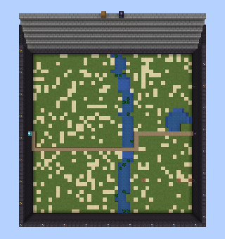
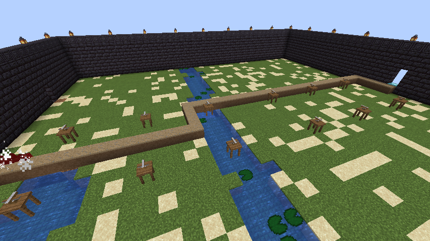
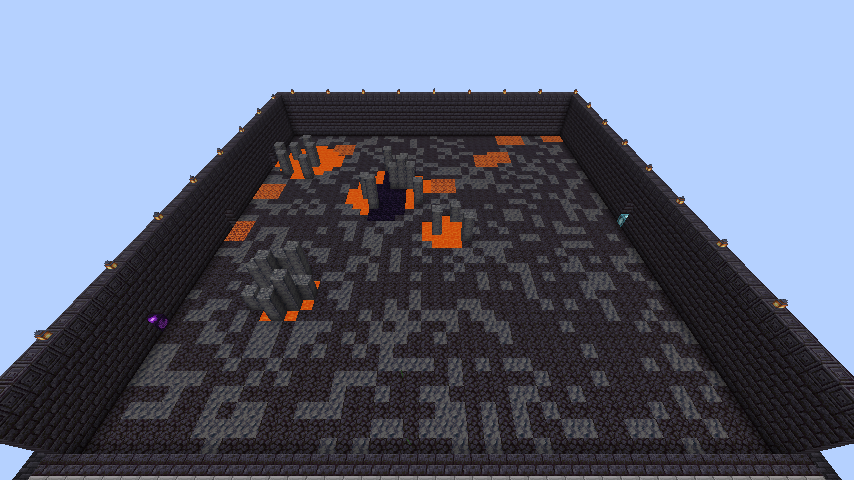
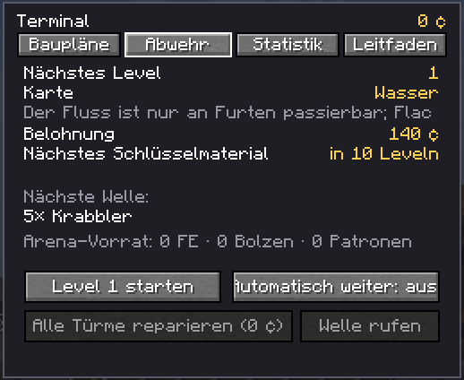
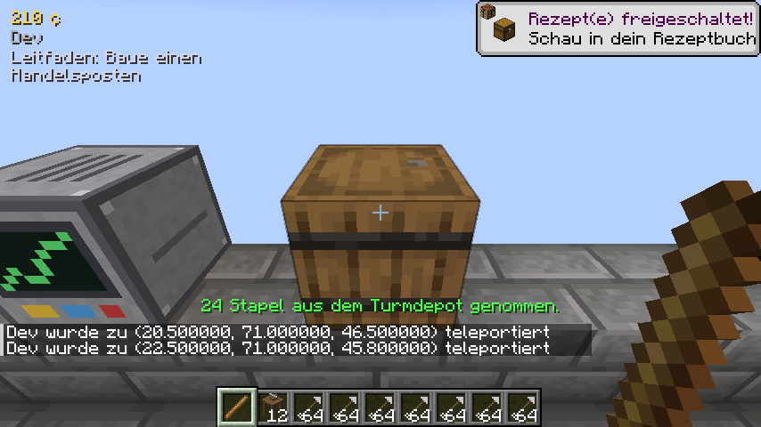

### M6 – Höhlenschicht

- **Schichten** (nur in neu erzeugten Chunks): Oberfläche ab Y 50, darunter **Deckgestein** (Y 40–49),
  die **Höhlenschicht** (Y 0–39) und eine zweite Deckgesteinsschicht (Y −10 bis −1). Die Höhlenschicht besteht
  zunächst komplett aus unzerstörbarem **Höhlengeröll** – man kann nicht hineingraben.
- **Höhleneingang** (Forschung *Ölverarbeitung*, Material siehe unten): an der Oberfläche aufstellen, dann Material
  anliefern (128 Bruchstein, 32 Eisenplatten, 16 Zahnräder, 8 Motoren – per Hand, Band oder Greifarm) und mit
  Strom (40 FE/t über einen Strommast) eine Minute bohren lassen.
- Danach öffnet sich ein **Schacht mit Gerüst** (Schleichen zum Absteigen; oberhalb der Höhlen mit Stein
  verkleidet) und der Höhlenbereich von **7×7 Chunks** um den Eingang wird ausgehöhlt: eine große Halle mit
  Säulen, Tuffboden und Platz zum Bauen. Außerhalb bleibt eine Wand aus Höhlengeröll – weitere Eingänge
  erweitern das Gebiet nahtlos.
- **Höhlen-Rohstoff**: **Rohölquellen** (unzerstörbar, in Gruppen von zwei bis fünf auf dem Hallenboden). Ein **Pumpjack**
  (90 kW) auf der Quelle fördert 10 Rohöl/s je 100 % Ertrag; der Ertrag der Quelle liegt zwischen 100 und 300 %. Das Öl
  geht in Rohre und Tanks neben dem Pumpjack. In der **Ölraffinerie** (420 kW) wird es zu Petroleum (einfache Ölverarbeitung:
  100 Rohöl → 45 Petroleum in 5 s); die **Chemiefabrik** (210 kW) macht daraus *Kunststoff* (1 Kohle + 20 Petroleum → 2),
  *Schwefel* (30 Wasser + 30 Petroleum → 2), *Schwefelsäure* (5 Schwefel + 1 Eisenplatte + 100 Wasser → 50) und *Batterien*
  (1 Eisenplatte + 1 Kupferplatte + 20 Säure). Beide Maschinen haben ein Menü mit Rezeptwahl, Zutaten-Vorschau und Flüssigkeitsbalken;
  Zutaten kommen per Greifarm und Rohr, das Produkt geht nach vorn oder in die Rohre. Der **fortgeschrittene Schaltkreis** (2 Schaltkreise +
  2 Kunststoff + 4 Kabel) und das **blaue Paket** (2 Motoren + 3 fortgeschrittene Schaltkreise + 1 Schwefel → 2) werden in der
  Montagemaschine bzw. an der Werkbank gebaut. Der **Akku** (2 Eisenplatten + 5 Batterien; 5 MJ, 300 kW) lädt aus dem Überschuss
  der Generatoren und springt ein, wenn sie nicht reichen. Zinn, Blei, Titan, Gold, Quarz, Diamant, Kristalle und Energiekristalle
  gibt es nicht mehr; Zinn-/Blei-/Titan-Rezepte wurden auf Stahl, Kunststoff und Batterien umgestellt.

- **Warenaufzug** (Bauplan nach dem Höhleneingang, 2 Stück pro Bau): Zwei Aufzüge in derselben Spalte
  (gleiches X/Z) verbinden sich automatisch – auch durch Deckgestein und massiven Fels, bis 256 Blöcke weit.
  Rechtsklick wechselt den Modus: *nach oben senden*, *nach unten senden* oder *empfangen*. Sender nehmen
  Items per Band/Greifarm/Trichter an (bis 40 Items/s), Empfänger geben sie nach vorne aus.

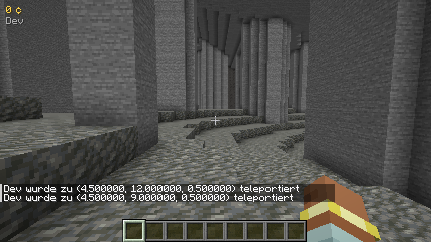
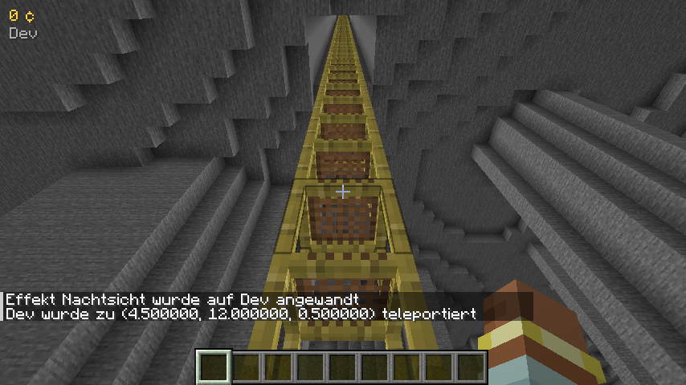

### M7 – Minenschicht

- **Minenschicht** (Y −59 bis −11, nur in neu erzeugten Chunks): unter dem zweiten Deckgestein, zunächst
  komplett aus unzerstörbarem **Minengeröll**. Niedrigere Gänge mit vielen Säulen, Basaltboden und Tiefenschiefer.
- **Minenschacht** (Forschung *Minenschacht*, braucht das Platin-Siegel und den Warenaufzug): wird in einem
  freigeschalteten Bereich der **Höhlenschicht** gebaut (sonst Fehlermeldung), braucht 64 Stahlplatten,
  16 Motoren, 8 Batterien und 8 fortgeschrittene Schaltkreise und bohrt mit **80 FE/t** (kW). Danach führt ein Gerüstschacht durch das Deckgestein in die Minen und 7×7 Chunks werden ausgehöhlt.
- **Minen-Rohstoff**: **Uran** → Uranpellet (Montage) → **Brennstab** (Montage, mit Stahlplatten).
- **Maschinen-Stufen**
  - **Elektrischer Bohrer** (Stufe 2): 3×3, doppelt so
    schnell wie der Brenner-Bohrer, 30 FE/t statt Brennstoff. **Tiefenbohrer** (Stufe 3): **5×5**, 4× schneller
    pro Block (bis 3 Items/s), 80 FE/t. Abbauflächen verschiedener Bohrer dürfen sich weiterhin nicht überlappen.
  - **Schnelles Förderband** (3,75 Blöcke/s, Stufe 2) und **Express-Förderband** (5,625 Blöcke/s, Stufe 3);
    alle Bänder lassen sich beliebig verbinden.
  - **Reaktor** (Stufe 3): 400 FE/t aus Brennstäben (5 Minuten pro Stab), 200.000 FE Puffer.
- **Tower Defense**: Ab Level 20 kommen **Kristallgolems** – ihr Panzer lässt nur 35 % von Munitionsschaden
  durch; Energietürme (Tesla, Laser) machen vollen Schaden. Der **Laserturm** (Stufe 3) schießt 14 Blöcke weit
  mit 30 Schaden (800 FE pro Schuss).
- Admin-Befehl: `/craftorio layer unlock caves|mines` schaltet den Bereich um die eigene Position ohne Eingang
  frei (für Tests oder alte Welten).

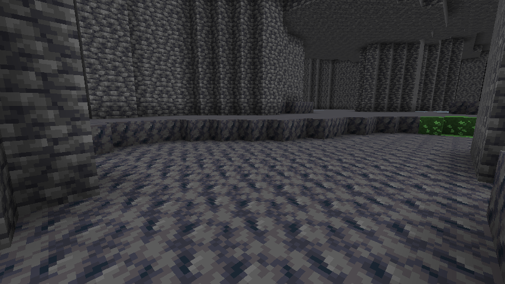
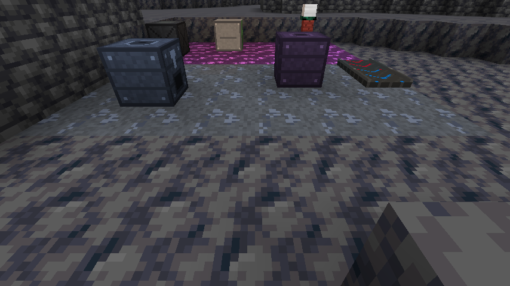
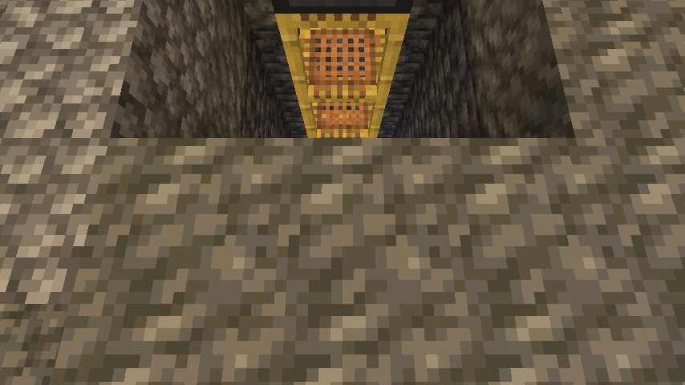
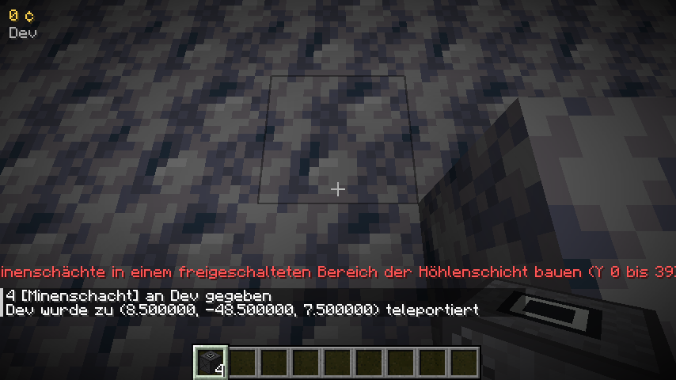

### M8 – Coop & Polish

- **Craftorio-Handbuch**: Jeder Spieler bekommt es beim ersten Betreten (Ersatz: Buch + Eisenbarren, oder
  `/craftorio guide`); öffnen per Rechtsklick oder jederzeit mit **G**. Es schlägt den aktuellen Leitfaden-Schritt
  auf und zeigt, **wie man ihn schafft**: Bauplan-Material mit Symbolen, die zugehörige Forschung, das Crafting-Raster
  der Konstruktionswerkbank, oder bei Verkaufszielen die Quelle (Erzfeld, Ofen, Montage). Mit den Pfeilen blättert man durch alle Schritte. Ist ein Ziel erreicht, wird der mittlere Button zu
  **„Belohnung abholen"** – ein Terminal braucht man dafür nicht.

- **Starter-Kit** (Server-Config `economy.starterKit`, Standard an): Beim ersten Betreten gibt es zusätzlich die
  unzerstörbare **Starter-Spitzhacke**, eine Konstruktionswerkbank und 16 Kohle.
- **Einstieg wie in Factorio – ohne Werkzeuge bauen zu müssen**: Mit der Starter-Spitzhacke baut man Erzfelder
  (das Feld bleibt stehen) und Stein von Hand ab, stellt einen Ofen her und schmilzt das erste Eisen. Der Leitfaden
  beginnt mit *16 Eisenerz per Hand abbauen* → *Brenner-Bohrer* → *Handelsposten* → *erster Verkauf*.
- **„Fehlt?"** an der Werkbank: Fehlendes Material ist rot markiert, der Tooltip zeigt „du hast X". Ein Klick auf
  *Fehlt?* listet im Chat genau, was noch fehlt.
- **Hinweis-Popups**: Sobald ein Leitfaden-Ziel erreicht ist, erscheint oben rechts „Erreicht! Mit G abholen" –
  die Belohnung holt man im Handbuch (oder im Terminal) ab.

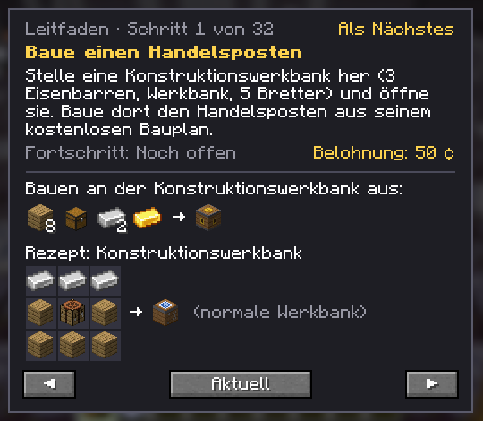
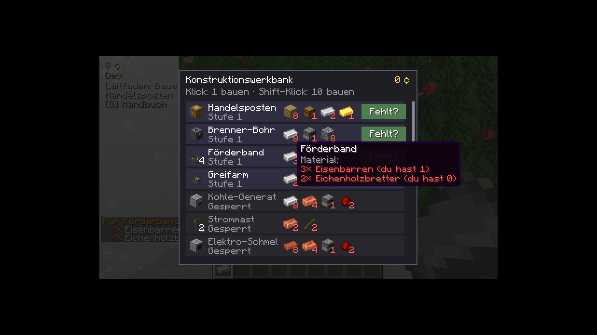

- **Leitfaden** – die Questline führt Schritt für Schritt durchs Spiel: 33 Ziele vom ersten Handabbau über
  Strom, Tower Defense, Höhlen bis zu Minen und 1 Mio. ¢. Jedes Ziel hat eine **Anleitung** (Tooltip im
  Terminal-Tab *Leitfaden*), der **nächste Schritt** ist markiert und steht mit Fortschritt dauerhaft im **HUD**
  unter dem Kontostand. Gemessen werden von Hand abgebaute Erze, Verkäufe, gekaufte und an der Werkbank gebaute
  Baupläne, Gesamtverdienst und TD-Level; Belohnungen (Credits) holt man einmal pro Team im Handbuch oder Terminal ab.
- **Team-Rechte**: Das erste Mitglied ist die **Teamleitung**. Sie kann Mitglieder entfernen
  (`/craftorio team kick <Spieler>`), die Leitung übergeben (`/craftorio team leader <Spieler>`) und festlegen,
  wer Credits ausgeben darf (`/craftorio team spending all|leader`) – gilt für Baupläne, Turm-Upgrades,
  Reparaturen und Wiederaufbau. `/craftorio team info` zeigt Leitung und Ausgaberecht.
- **Blockschutz zwischen Teams** (Server-Config `protection.enabled`, Standard an): Maschinen, Türme und alle
  Blöcke mit Inventar gehören dem Team, das sie platziert hat. Andere Teams können sie nicht abbauen oder
  öffnen, Explosionen zerstören sie nicht. Geschützte Blöcke verschiedener Teams dürfen sich **nicht berühren**
  (ein Block Abstand) – so kann kein Trichter, Band, Bohrer, Aufzug oder Greifarm Items in eine fremde Basis
  hinein- oder herausbewegen; Greifarme prüfen das zusätzlich selbst. Tritt ein Solo-Spieler einem Team bei,
  gehen seine Blöcke **und seine TD-Zone** an das neue Team über. Operatoren im Kreativmodus dürfen alles.
- **Skalierung**: Pro zusätzlichem Teammitglied online kommen je Welle 2 Krabbler mehr (zusätzlich zu +35 %
  Gegner-HP); die Belohnung bleibt gleich.
- **Balancing-Test**: Ein GameTest prüft, dass jede Montagestufe und jedes Ofenrezept mit Mengen mindestens 10 % Wert schafft und kein
  Schmelzrezept Wert vernichtet.
- **EMI** (optional): Kategorien *Montage* und *Bauplan (Werkbank)* mit der nötigen Forschung. **Jade** (optional): Besitzer-Team, Bohrer-Rate, Maschinenfortschritt, Turm-HP/Munition,
  Ruinen-Kosten, Baustellen- und Aufzugsstatus sowie Ertrag und Wert von Erzfeldern.
  Im Dev-Client mit `./gradlew runClient -Pcompat` laden.
  **Empfehlung für Spieler:** EMI (für 1.21.1/NeoForge, z. B. von Modrinth) einfach zusätzlich in den
  `mods`-Ordner des **Clients** legen – dann zeigt ein Klick auf ein Item (R = Rezept, U = Verwendung), wie man
  es herstellt. Auf dem Server ist EMI nicht nötig.

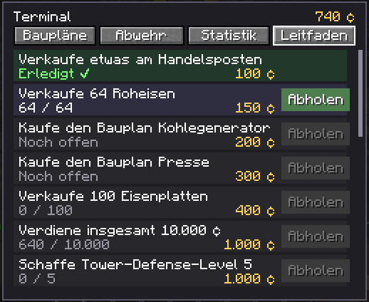
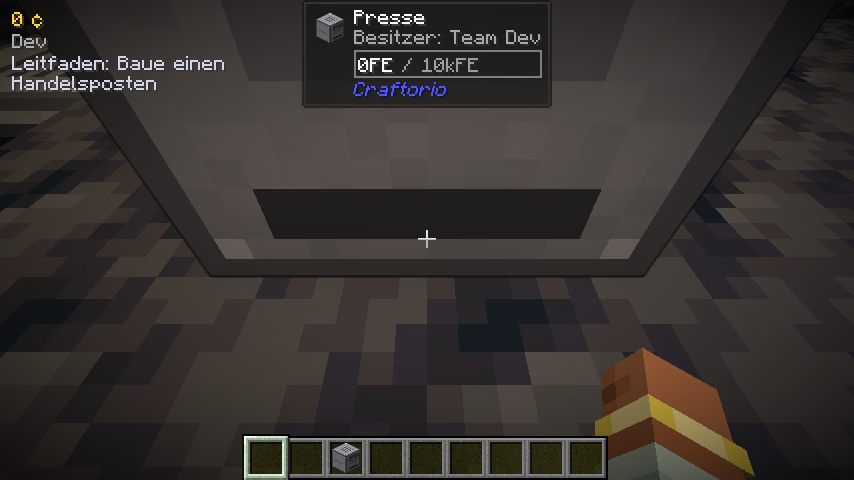
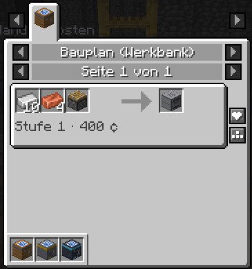
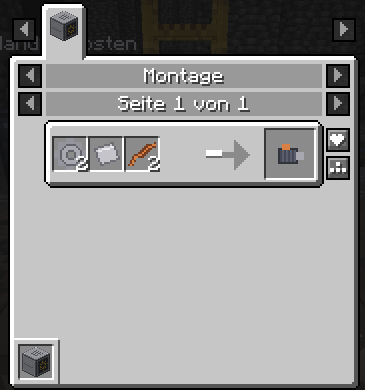

### Factorio-Umbau (in Arbeit, siehe `docs/FACTORIO-UMBAU.md`)

Umgesetzt: **U0** (Arena-Fehler und -Komfort), **U1** (Grundlagen), **U2** (Forschungssystem), **U3** (Rot), **U4** (Logistik), **U5** (Grün und Stahl), **U6** (Flüssigkeiten) **U7** (Öl und Höhlen) und **U8** (Militär und Tower Defense).

- **Energie-Einheit**: 1 kW = 1 FE/t (1 MJ = 20.000 FE). Dampfmaschine 900 kW, Elektro-Ofen
  180 kW, Assembler 75 kW, Elektro-Bohrer 90 kW; der Brenner-Bohrer schafft 0,25 Erz/s bei 150 kW Brennstoff.
- **Brennwerte** wie in Factorio: Kohle 4 MJ, Holz 2 MJ; Brenner-Bohrer und Generatoren rechnen die Brenndauer aus
  Brennwert und Leistung.
- **Tempo-Faktoren** in `serverconfig/craftorio-server.toml`: `pacing.craftingSpeed` (Maschinen und Schmelzen),
  `pacing.miningSpeed` (Bohrer), `pacing.researchCost` (ab dem Forschungssystem). Standard 1,0 = Factorio-Zeiten;
  Bänder bleiben fest.
- **Team-Chunkloader**: Die Chunks mit den meisten Maschinen eines Teams bleiben geladen (`chunkloader.chunksPerTeam`,
  Standard 64; `chunkloader.onlyWhileOnline`, Standard an), damit die Fabrik weiterläuft, während das Team in der
  Arena ist. Die Tickets werden alle 5 Sekunden abgeglichen und nach einem Neustart neu gesetzt.
- **Forschung statt Baupläne kaufen**: Neue Rezepte werden im Terminal-Tab *Forschung* freigeschaltet. Jede Forschung
  kostet *Einheiten × Wissenschaftspakete* mit einer Zeit pro Einheit; ein **Labor** (Block, 60 kW) nimmt die Pakete
  entgegen (ein Slot je Paketart, auch per Greifarm), verbraucht je Einheit ein Paket jeder benötigten Art und meldet
  den Fortschritt an das Team. Mehrere Labore forschen parallel an derselben Forschung. Es gibt eine Warteschlange
  (Ketten dürfen in einem Zug eingereiht werden); der Fortschritt bleibt beim Umschalten erhalten. Schlüsselmaterial
  (ein Arena-Siegel) wird einmal beim ersten Einreihen abgegeben. Forschungen sind Datenpakete
  (`data/<namespace>/craftorio/research/*.json`: `units`, `packs`, `seconds`, `requires`, `unlocks`, `unlock_items`);
  was keine Forschung freischaltet, ist von Anfang an verfügbar. Werkbank-Rezepte **und** Maschinenrezepte (z. B.
  `assembling/motor`) können gesperrt sein; Maschinen prüfen die Forschung des besitzenden Teams. Credits bezahlen
  keine Forschung mehr. Die Zeitpunkte der Abschlüsse stehen im Statistik-Tab. Der Baum deckt vorerst nur den
  heutigen Inhalt ab (mit rotem Paket) und wächst mit den folgenden Paketen.
- **Rot (U3)**: Steinfeld als vierter Rohstoff, Steinofen, Kessel/Dampfmaschine/Offshore-Pumpe, Labor, Montagemaschine 1;
  Rezepte und Zeiten nach Factorio 1.1 (durch `RecipeTableGameTests` gegen die Tabelle aus dem Umbau-Dokument
  geprüft); Presse, Eisenplatten-Item, Kohle-Generator und die Werkbank-Stufen mit Aufrüstsätzen entfallen. Kein
  Rezept braucht mehr Gold oder Redstone; `ProgressionGameTests` stellt sicher, dass jedes Rezept aus dem
  Handabbau heraus herstellbar ist. Abweichungen: Kisten sind vorerst die Vanilla-Truhe, Brenner-Greifarm und
  Greifarm-Varianten folgen mit U4 (Logistik), Flüssigkeiten mit U6.
- **Logistik (U4)**: *Unterflurband* (Forschung Logistik; zwei Teile, das zweite bis zu 4 Blöcke hinter dem ersten in
  einer Linie wird zum Ausgang, das schnelle Unterflurband schafft 6), *Splitter* (ein Block breit: Eingang hinten,
  Ausgänge vorne, links und rechts; Items wechseln reihum zwischen den **angeschlossenen** Ausgängen – ohne Band oder
  Kiste vorne gehen sie 50/50 nach links und rechts; Rechtsklick mit einem Item setzt einen **Filter**, Rechtsklick
  mit leerer Hand bestimmt, in welche Richtung das gefilterte Item geht, der Rest wechselt zwischen den anderen
  Ausgängen; Schleichen + Rechtsklick löscht den Filter), **steigende und fallende Bänder** (ein Band mit einem höheren Band davor bzw.
  dahinter wird zur Schräge, egal welches zuerst gesetzt wird; Rechtsklick mit einem Band in der Hand auf die Oberseite eines Bands (oder mit
  leerer Hand) schaltet flach → hoch → runter; ein steigendes
  Band gibt an das Band eine Ebene höher weiter, ein fallendes nimmt von einer Ebene höher), **Greifarm-Varianten**
  (langer Greifarm: Reichweite 2, schneller Greifarm, Filter-Greifarm mit Filter per Rechtsklick; Schwingzeiten wie
  in Factorio). Kurze Steuerungshinweise mit Maus-/Tasten-Symbolen erscheinen rechts neben der Hotbar. Das rote Band kostet nach Factorio 5 Zahnräder + 1 gelbes Band. Abweichungen: Greifarme brauchen
  vorerst keinen Strom (kein Brenner-Greifarm), Express-Unterflurband und -Splitter folgen mit Schmiermittel (U7).
- **Grün und Stahl (U5)**: *Stahlplatte* (5 Eisenplatten, 16 s im Ofen; Forschung Stahlverarbeitung), *Grünes Paket*
  (1 Greifarm + 1 Förderband, 6 s; Forschung Logistik-Wissenschaftspaket), *Motor* (1 Stahl + 1 Zahnrad + 2 Rohre, nur in
  der Montagemaschine; Forschung Motor), *Stahlofen* (Geschwindigkeit 2, Brennstoff), *Montagemaschine 2* (Geschwindigkeit
  0,75, 150 kW), *mittlerer Strommast* (versorgt 7×7, Kabel bis 9 Blöcke; zwischen zwei Masten gilt die kürzere Reichweite)
  und *Solarpanel* (bis 60 kW, tags voll, in der Dämmerung abnehmend, nachts nichts; braucht freien Himmel). Neu ist die
  *Eisenstange*, und Forschungen können jetzt rote und grüne Pakete kosten (Motor, Automatisierung 2, Energieverteilung 1,
  Fortgeschrittene Materialverarbeitung, Solarenergie, Logistik 2). Abweichungen: keine Stahlkiste (es gibt noch keine
  Kisten-Blöcke); da die Welt standardmäßig keine Nacht hat, liefert das Solarpanel dort immer volle Leistung.
- **Flüssigkeiten (U6)**: Rohre verbinden sich von selbst mit allem, was Flüssigkeit aufnimmt oder abgibt (Rohre, Tanks,
  Pumpen, Kessel, Dampfmaschine, Offshore-Pumpe). Jedes Rohr fasst 100 Einheiten, der *Tank* 25.000; angeschlossene Behälter
  gleichen ihren Füllstand aus (bis 60 Einheiten pro Tick und Verbindung). Die *Pumpe* (Forschung Flüssigkeitsverarbeitung, 29 kW)
  saugt aus dem Block hinter ihr und drückt in den davor; die *Rohr-Unterführung* verbindet zwei Stücke in einer Linie bis 9
  Blöcke voneinander (das zweite dreht sich beim Setzen von selbst um). Die Offshore-Pumpe liefert 1200 Wasser/s an alle
  angrenzenden Rohre und Kessel. Der *Kessel* macht aus 1,8 MW Brennstoff 60 Dampf/s (Wasser 1:10) und gibt ihn an Rohre und
  Maschinen ab; die *Dampfmaschine* braucht 30 Dampf/s für 900 kW und nur, solange jemand den Strom abnimmt. Rechtsklick auf
  Rohr, Tank und Pumpe zeigt Inhalt und Zustand. Flüssigkeiten leben nur in Behältern (keine Eimer, keine Blöcke in der Welt);
  Rohöl, Schweröl, Leichtöl, Petroleum, Schwefelsäure und Schmiermittel sind schon angelegt und werden mit U7 gebraucht.
- **Militär (U8)**: *Magazin* (4 Eisenplatten), *panzerbrechendes Magazin* (+1 Stahl, 5 Kupfer), *Granate* (5 Kohle + 5 Eisen),
  *Steinmauer* (5 Steinziegel) und das **graue Militärpaket** (1 panzerbrechendes Magazin + 1 Granate + 2 Steinmauern → 2, Forschung
  Militär-Wissenschaftspaket mit dem silbernen Siegel). Neue Forschungen: Militär 2, Steinmauern, Flammenwerfer, Laser (blaues Paket) und
  Laserturm (rot, grün, Militär). Der **Flammenwerfer-Turm** (30 Stahl, 15 Zahnräder, 10 Rohre, 5 Motoren) verbrennt 6 Rohöl pro Schuss aus
  dem Arena-Vorrat (bis 20.000), das der Arena-Einspeiser aus angeschlossenen Rohren nimmt. Der Laserturm kostet jetzt 20 Stahl, 20 Schaltkreise und
  12 Batterien. Der alte Bohrkern, Resonanzkristall, Tiefenkern und Sternenerz-Splitter sind durch die vier Siegel ersetzt. Abweichungen: Der Tesla-Turm
  bleibt vorerst; der Flammenwerfer nutzt nur Rohöl (Schwer- und Leichtöl folgen mit der fortgeschrittenen Ölverarbeitung).
- **Steuerungshinweise**: Rechts neben der Hotbar zeigt das HUD, was die rechte Maustaste mit dem Item in der Hand (oder dem
  angesehenen Block) macht – für Bänder, Unterflurbänder, Splitter, Filter-Greifarm, Pfadstab und Handbuch.
- **Werkzeuge**: Spitzhacken, Äxte, Schaufeln und Hacken sind nicht mehr herstellbar (die Starter-Spitzhacke reicht);
  Schwerter, Rüstung und Schere bleiben.

## Projektstruktur

```
src/main/java/de/craftorio/
├── Craftorio.java          Mod-Einstiegspunkt
├── CraftorioConfig.java    Server-Konfiguration
├── registry/               Blöcke, Items, Block-Entities, Creative-Tab
├── team/                   Teams, Konto, Rechte (TeamRegistry ist reine Logik mit Unit-Tests)
├── protection/             Blockschutz zwischen Teams
├── quest/                  Leitfaden (Ziele als reine Logik mit Unit-Tests)
├── compat/                 Optionale EMI- und Jade-Plugins
├── economy/                Preise (Data Map), Verkauf, Handelsposten
├── world/                  Erzfelder, Weltgenerierung, Start-Felder
│   └── cave/               Höhlen-/Minenschicht, Form (reine Logik mit Unit-Tests), Eingänge/Schächte, Aushöhlen
├── machine/                Bohrer-Stufen (Abbaufläche, Produktionsrate), Verarbeitungsmaschinen
├── logistics/              Förderband-Stufen (BeltLane = reine Spur-Logik mit Unit-Tests), Greifarm, Warenaufzug
├── energy/                 Kessel/Dampfmaschine/Offshore-Pumpe, Reaktor, Strommast, Stromnetz (Verteilung als reine Logik mit Unit-Tests)
├── recipe/                 Maschinenrezepte (Ofen mit Mengen, Montage)
├── blueprint/              Baupläne (Werkbank-Rezepte), Terminal, Werkbank
├── research/               Forschung: Datenmodell, Regeln (rein), Labor, Aktionen
├── defense/                Tower Defense: Level-Ablauf, Gegner, Türme (LevelPlan/PathTracer/TowerStats = reine Logik)
│   └── arena/              Arena-Dimension, Kartengenerator mit Themen (reine Logik), Bau, Regeln, Pfadstab, Einspeiser
├── menu/                   Container-Menüs der Maschinen
├── command/                /craftorio-Befehle
├── network/                Server→Client-Sync
├── client/                 HUD, Tooltips
├── gametest/               Tests im laufenden Spiel
└── datagen/                Datengeneratoren
src/test/java/              Unit-Tests (JUnit)
src/main/templates/         neoforge.mods.toml (wird aus gradle.properties befüllt)
src/main/resources/         Handgemachte Assets (Texturen)
```
